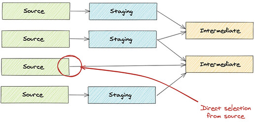
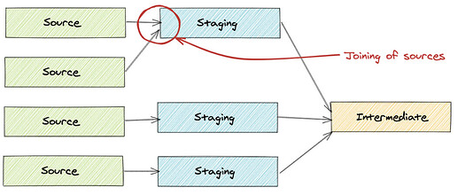
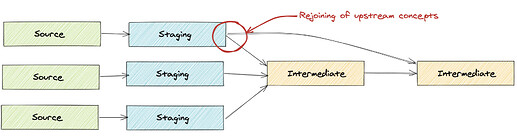
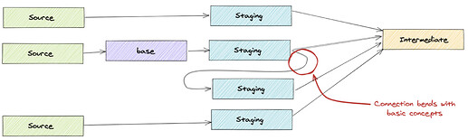
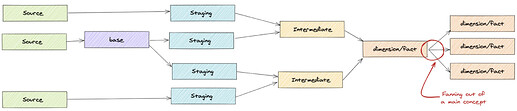
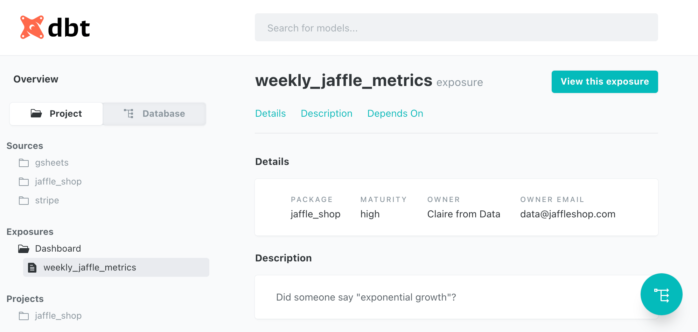
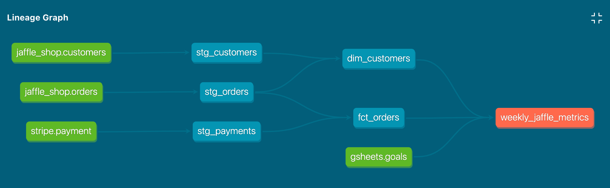
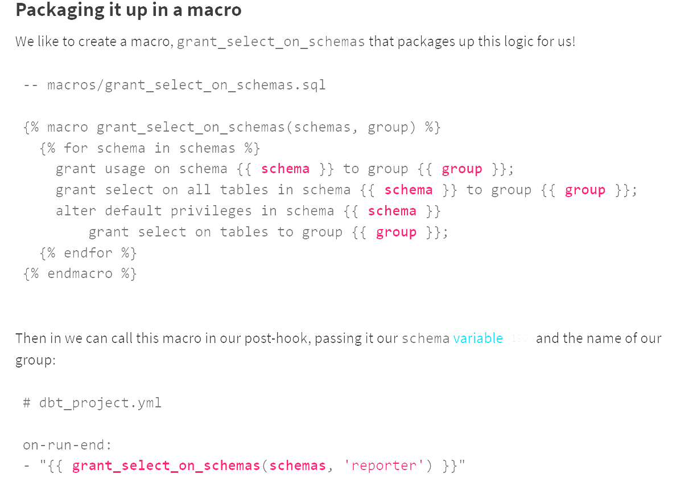

# Exam prep

## Viewpoint

### Analytics is collaborative

- Version control: code needs version control
- Quality assurance: code needs to be reviewed
- Documentation: there needs to be definitions
- Modularity

### Analytic code is an asset

We believe a mature analytics organization’s workflow should have the following characteristics so as to protect and grow that investment:

- Environments: analytics require multiple environments
- Service level guarantees: 
- Design for maintainability: future changes to the schema and data should be anticipated and code should be written in a way to minimise the corresponding impact. 

## Sources

### Source properties

Source properties are declared in .yml files sitting in models/ directory. These files can be named whatever 

### Source configuration

Sources only support one configuration, enabled. They can be configured via a **config:** block within their .yml definitions, or from the dbt_project.yml file under the **sources:** key. 

When a resource is disabled, dbt will not consider it as a part of your project, though this may cause compilation errors. IF you want to exclude some model in a particular run, consider using *--exclude* parameter

This could be useful when you disable a model in a package to use your own, or to disable source freshness checks running on source tables from packages. 

### database 

The database your source is stored in.

```
version: 2

sources:
  - name: <source_name>
    database: <database_name>
    tables:
      - name: <table_name>
      - ...
```

### external

A dictionary of metadata specific to sources that point to external tables. These are optional built in properties.

### freshness

The acceptable amount of time between the most recent record, and now, for a table to be considered "fresh"

It has:
- **warn_after**
- **error_after**
If neither are provided then dbt won't calculate freshness.

Additionally, the **loaded_at_field** is required to calculate freshness for a table, if it isn't provided then freshness wont be calculated. 

Freshness blocks are applied hierarchically:
- a freshness and loaded_at_field property added to a source will be applied to all all tables defined in that source
- a freshness and loaded_at_field property added to a source table will override any properties applied to the source.

models/<filename>.yml
```
version: 2

sources:
  - name: jaffle_shop
    database: raw

    freshness: # default freshness
      warn_after: {count: 12, period: hour}
      error_after: {count: 24, period: hour}

    loaded_at_field: _etl_loaded_at

    tables:
      - name: customers # this will use the freshness defined above

      - name: orders
        freshness: # make this a little more strict
          warn_after: {count: 6, period: hour}
          error_after: {count: 12, period: hour}
          # Apply a where clause in the freshness query
          filter: datediff('day', _etl_loaded_at, current_timestamp) < 2
```

### identifier

The table name as stored in the database. By default dbt will use the table's **name:** but the identifier parameter is useful if you want to use a source table name that differs from the table name in the database.

models/<filename>.yml
```
version: 2

sources:
  - name: jaffle_shop
    tables:
      - name: orders
        identifier: api_orders
```

In a downstream model:
```
select * from {{ source('jaffle_shop', 'orders') }}
```

Will get compiled to:
```
select * from jaffle_shop.api_orders
```

### loader (documentation only)

Describe the tool that loads this source into your warehouse, this property is for documentation purposes only. It is not used in any meaningful way. 

### quoting

Optionally configure whether dbt should quote databases, schemas, and identifiers when resolving a {{ source () }} function to a direct relation reference. 

models/<filename>.yml
```
version: 2

sources:
  - name: jaffle_shop
    database: raw
    quoting:
      database: true
      schema: true
      identifier: true

    tables:
      - name: orders
      - name: customers
        # This overrides the `jaffle_shop` quoting config
        quoting:
          identifier: false
```

In a downstream model:
```
select
  ...

-- this should be quoted
from {{ source('jaffle_shop', 'orders') }}

-- here, the identifier should be unquoted
left join {{ source('jaffle_shop', 'customers') }} using (order_id)
```
This will get compiled to:
```
select
  ...

-- this should be quoted
from "raw"."jaffle_shop"."orders"

-- here, the identifier should be unquoted
left join "raw"."jaffle_shop".customers using (order_id)
``` 

### schema

The schema name as stored in the database. This parameter is useful if you want to use a source name that differs from the schema name. By default dbt will use the source's **name:** parameter as the schema name.

models/<filename>.yml
```
version: 2

sources:
  - name: jaffle_shop
    schema: postgres_backend_public_schema
    tables:
      - name: orders
```

In a downstream model:
```
select * from {{ source('jaffle_shop', 'orders') }}
```
Will get compiled to:
```
select * from postgres_backend_public_schema.orders
```

### overrides

Override a source defined in an included package. The properties defined in the overriding source will be applied on top of the base properties of the overridden sources.

The following source properties can be overridden:
- description
- meta
- database
- schema
- loader
- quoting
- freshness
- loaded_at_field
- tags

## Syntax overview

### Arguments

#### '--selector'

You can write resources selectors in YAML, save them and reference them using --selector. 

By recording selectors in a top-level **selectors.yml** file:

- Legibility: complex selection criteria are composed of dictionaries and arrays
- Version control: selector definitions are stored in the same git repository as the dbt project
- Reusability: selectors can be referenced in multiple job definitions, and their definitions are extensible (via YAML anchors)

Selectors live in a top-level file named selectors.yml. Each must have a name and a definition, and can optionally define a description and default flag.

selector.yml
```
selectors:
  - name: nodes_to_joy
    definition: ...
  - name: nodes_to_a_grecian_urn
    description: Attic shape with a fair attitude
    default: true
    definition: ...
```

The definition comprises one or more arguments, which can be:
- CLI-style: strings, representing CLI style arguments. This simple syntax supports use of the +, @, and * operators. Does not support exclude.
```
definition:
    'tag:nightly'
```

- Key-value: pairs in the form 'method: value'. This simple syntax does not support any operators or exclude.
```
definition:
  tag: nightly
```

- Full YAML: fully specified dictionaries with items for method, value, operator-equivalent keywords, and support for exclude.
```
definition:
  method: tag
  value: nightly

  # Optional keywords map to the `+` and `@` operators:

  children: true | false
  parents: true | false

  children_depth: 1    # if children: true, degrees to include
  parents_depth: 1     # if parents: true, degrees to include

  childrens_parents: true | false     # @ operator
  
  indirect_selection: eager | cautious  # include all tests selected indirectly? eager by default
```

#### '--select' or '-s'

By default dbt run/seed/snapshot will execute all nodes. Is used to specify a subset of nodes to execute (a particular model/seed/snapshot). 

How does selection work?
1. dbt gathers all the resources that are matched by one or more of the --select criteria, in the order of selection methods (e.g. tag:), then graph operators (e.g. +), then finally set operators (unions, intersections, exclusions).

2. The selected resources may be models, sources, seeds, snapshots, tests. (Tests can also be selected "indirectly" via their parents; see test selection examples for details.)

3. dbt now has a list of still-selected resources of varying types. As a final step, it tosses away any resource that does not match the resource type of the current task. (Only seeds are kept for dbt seed, only models for dbt run, only tests for dbt test, and so on.)

### run

e.g.
> dbt run --full-refresh

Arguments:
- '--select'
- '--exclude'
- '--selector'
- '--defer'

It executes compiled sql model files against the current target database. dbt connects to the target database and runs the relevant SQL required to materialise all data models using the specified materialisation strategies. Models are run in the order defined by the dependency graph generated during compilation. Intelligent multi-threading (things running synchronously) is used to minimize execution time without violating dependencies.

You can provide '--full-refresh' argument to dbt run, which will treat incremental models as table models, and it is useful when
1. The schema of an incremental model changes and you need to recreated it
2. You want to reprocess the entirety of the incremental model because of new logic in the model code.

### run-operation

e.g. 
> dbt run-operation {macro} --args {args}
The *dbt run-operation* command id used to involve a macro.

### test

e.g.
> dbt test --select one_specific_model,test_type:singular(generic)

Arguments:
- '--select'
- '--exclude'
- '--selector'
- '--defer'

It runs tests defined on models, sources,snapshots, and seeds. It expects that you have already created those resources through teh appropriate commands. You can use --select to run particular tests, or run tests for particular models, or run particular tests for particular models.

### seed

e.g.
> dbt seed --select country_codes

The seed command will load csv files located in the seed-paths directory of your dbt project into your data warehouse. 

### snapshot

The snapshot command executes the snapshots defined in your project. In dbt, snapshots are select statements, defined within a snapshot block in a .sql file (typically in your snapshots directory).

dbt will look for Snapshtos in the snapshot-path defined in your dbt_project.yml file. By default, the snapshot-paths path is **snapshot/**. That are you can put the config block into the your snapshot .sql file. 

### ls (list)

Arguments:

- '--resource-type': This flag limits the "resource types" that dbt will return in the dbt ls command. By default, the following resources are included in the results of dbt ls: models, snapshots, seeds, tests, and sources.
- '--select': This flag specifies one or more selection-type arguments used to filter the nodes returned by the dbt ls command
- '--models': Like the --select flag, this flag is used to select nodes. It implies --resource-type=model, and will only return models in the results of the dbt ls command. Supported for backwards compatibility only.
- '--exclude': Specify selectors that should be excluded from the list of returned nodes.
- '--selector': This flag specifies one or more named selectors, defined in a selectors.yml file.
- '--output': This flag controls the format of output from the dbt ls command.
- '--output-keys': If --output json, this flag controls which node properties are included in the output.

This command list resources you have in your dbt project. It accepts selector arguments that are similar to those in dbt run. 

### compile

Arguments:
- '--select'
- '--exclude'
- '--selector'

Generates executable SQL form source model, test, and analyses files. You can find these compiled SQL files in the **target/** directory of your dbt project. 

The compile command is useful for:
1. Visually inspecting the compiled output of model files. This is useful for validating complex jinja logic or macro usage. 
2. Manually running compiled SQL. While debugging a model ro schema test, it's often useful to execute the underlying select statement to find the source of the bug. 
3. Compiling analysis files. 

It is not a pre-requisite of dbt run.

### freshness 

e.g. Snapshot freshness for all Snowplow tables:
> dbt source freshness --select source:snowplow

Snapshot freshness for a particular source table:
> dbt source freshness --select source:snowplow.event

To check freshness of source files. When it finishes running, a JSON file containing info on freshness will be created at **target/sources.json**. To override the location of output use -o or --output

>  dbt source freshness --output target/source_freshness.json

### build

This command will:
- run models
- test tests
- snapshott snapshots
- seed seeds 

Artifacts: build will create a single manifest and a single run results artifact. It will tell you all about models, tests, seeds, and snapshots that were selected to build, combined into one file. 

Skipping on failures: Tests on upstream resources will block downstream resources from running, and a test failure will cause those downstream resources to skip entirely. E.g. if model_b depends on model_a, and a unique test on model_a fails, then model_b will SKIP. 
  
  - If you dont want a test to cause skipping then adjust severity or thresholds to *warn* instead of *error*.
  -  In case of a test with multiple parents, where one parent depends on the other (e.g. a relationship test between model_a + model_b), that these will block and skip children of the most downstream parent only (model_b)

Selecting resources: the build task supports standard selection syntax (--select, --exclude, --selector), as well as a --resource-type flag that offers a final filter (just like *list*). WHichever resources are selected, those are the ones that build execute. 

  - Tests support indirect selection, so dbt build -s model_a will both run and test model_a. What does that mean? Any tests that directly depend on model_a will be included, so long as those tests dont also depend on other unselected parents. 

Flags: the build task supports all the same flags as run, test, snapshot, and seed. For flags that are shared between multiple tasks (e.g. --full-refresh ), build will use the same value for all selected resource types (e.g. both models and seeds will be full refreshed)

## General properties

### columns

e.g. models
```
version: 2

models:
  - name: <model_name>
    columns:
      - name: <column_name>
        data_type: <string>
        [description](description): <markdown_string>
        [quote](quote): true | false
        [tests](resource-properties/tests): ...
        [tags](resource-configs/tags): ...
        [meta](resource-configs/meta): ...
      - name: <another_column>
        ...
```

They are not resources in and of themselves, and instead they are child properties of another resource type. They can define sub-properties that are similar to properties defined at the resource level:
- tags
- meta 
- tests 
- description

As columns are not resources, *tags* and *meta* properties are not true configurations. They do not inherit the *tags* or *meta* values of their parent resources.

However, you can select a generic test, defined on a column, using tags applied to its column or top-level resources.

```
version: 2

models:
  - name: orders
    columns:
      - name: order_id
        tests:
        tags: [my_column_tag]
          - unique
```

> $ dbt test --select tag:my_column_tag

Columns may also optionally define *data_type*. This is for metadata purposes only, such as to use alongside the *external* property of sources. 

### config

e.g.
```
version: 2

models:
  - name: <model_name>
    config:
      [<model_config>](model-configs): <config_value>
      ...
```

The config property allows your to configure resources at the same time you're defining properties in yaml files. 

### description

A user defined description can be used to document:
- a model, and model columns
- sources, source tables, and source columns
- seeds, and seed columns
- snapshots, and snapshot columns
- analyses, and analysis columns
- macros, and macro arguments

These description are used by the documentation website rendered by dbt. It can be a simple description, a multi-line description, or a doc block:

e.g. doc-block

models/schema.yml
```
version: 2

models:
  - name: fct_orders
    description: This table has basic information about orders, as well as some derived facts based on payments

    columns:
      - name: status
        description: '{{ doc("orders_status") }}'
```


Doc blocks should be place in files with a .md extension. 

models/docs.md
```


Orders can be one of the following statuses:

| status         | description                                                               |
|----------------|---------------------------------------------------------------------------|
| placed         | The order has been placed but has not yet left the warehouse              |
| shipped        | The order has ben shipped to the customer and is currently in transit     |
| completed      | The order has been received by the customer                               |
| returned       | The order has been returned by the customer and received at the warehouse |



```

You link another model to the description or include links to images. 

### quote

e.g.
```
version: 2

sources:
  - name: source_name
    tables:
      - name: table_name
        columns:
          - name: column_name
            quote: true | false
``` 

The *quote* field can be used to enable or disable quoting for column names. Default is false. 

Quoting may be relevant to using SnowFlake, when:
- a source table has a column that needs to be quoted to be selected, for example, to preserve column casting. 
- a seed was created with *quote_columns: true* on Snowflake
- A model uses quites inteh SQL, potentially to work around the use of reseved workds
 >select user_group as "group"

Without setting *quote: true*:
- Schema tests appleid to this column may fail due to invalid SQL
- Documentation may not render correctly, e.g. *group* and *"group"* may not be matched as the same column name.

### tests

e.g.

models/<filename>.yml
```
version: 2

models:
  - name: <model_name>
    tests:
      - [<test_name>](#test_name):
          <argument_name>: <argument_value>
          [config](resource-properties/config):
            [<test_config>](test-configs): <config-value>

    [columns](columns):
      - name: <column_name>
        tests:
          - [<test_name>](#test_name)
          - [<test_name>](#test_name):
              <argument_name>: <argument_value>
              [config](resource-properties/config):
                [<test_config>](test-configs): <config-value>
```

Tests property defines assertions about a column, table, or view. The property contains a list of generic tests, reference by name, which can include the four built-in generic tests available in dbt.

For example, you can tests so that a column contains no duplicates and zero null values. Any arguments or configurations passed to those test should be nested below the test name.

Once defined, you can validate their correctness by running *dbt test*.

Out-of-box tests:
- not_null
- unique
- accepted_values
- relationships: validates that all of the records in a child table have a corresponding record in a parent table. 

Some tests require multiple columns so it doesn't make sense to nest them under the *columns:* key, in this case you can apply the test tot the model 9or source, seed, or snapshot) instead:

```
version: 2

models:
  - name: orders
    tests:
      - unique:
          column_name: "country_code || '-' || order_id"
```

### Configuring test 'severity'

Normally tests will throw error if the number of failure is a non-zero. But you can change the case to show warnings instead of error, or warning up to a certain number of failures and then error. 

The relevant configs:

- *severity*: *error* or *warn* (default: *error*)
- *error_if*: conditional expression (default:*!=0*)
- warn_if: conditional expression (default:*!=0*)

Conditional expression can be anything that SQl supports. How this works is:

- If *severity: error* dbt will check *error_if* first. If error condition is met, the test returns an error. If it is not met, dbt will then check the *warn_if* condition. If the warn condition is met, the test warns; if it is not met, the test passes.

- If *severity: warn* dbt will skip *error_if* condition entirely and jump straight to the *warn_if* condition. If the warn condition is met, the test warns; if it's not met, the test passes.


### Test selection examples

Test selection works a little differently from other resource selection. This makes it very easy to:

- run tests on a particular model
- run tests on all models in a subdirectory
- run tests on all models upstream/downstream of a model

Like all resource types they can be selected directly or indirectly.

#### Direct selection
Generic tests only:
> dbt test --select test_type:generic

Singular tests only:
> dbt test --select test_type:singular

#### Indirect selection

> dbt test --select customers

> dbt test --select orders

These are indirect selection as we are selecting the models but in these cases the tests defined in these models are run. by default a test with run when ANY parent is selected. This is also knows as "eager" indirect selection. 

It is possible to prevent test from running if one or more of its parent are unselected, this is called "cautious" indirect selection. This can be helpful if you are only building a subset of your DAG, and you want to avoid test failure on unbuilt resources (another way to achieve is with deferral).

> dbt test --indirect-selection=cautious

(Or setting *indirect_selection: cautious* in a yaml selector)

e.g.

> dbt test --select customers orders --indirect-selection=cautious

Syntax examples

```
# Run tests on a model (indirect selection)
$ dbt test --select customers

# Run tests on all models in the models/staging/jaffle_shop directory (indirect selection)
$ dbt test --select staging.jaffle_shop

# Run tests downstream of a model (note this will select those tests directly!)
$ dbt test --select stg_customers+

# Run tests upstream of a model (indirect selection)
$ dbt test --select +stg_customers

# Run tests on all models with a particular tag (direct + indirect)
$ dbt test --select tag:my_model_tag

# Run tests on all models with a particular materialization (indirect selection)
$ dbt test --select config.materialized:table

# tests on all sources
$ dbt test --select source:*

# tests on one source
$ dbt test --select source:jaffle_shop

# tests on one source table
$ dbt test --select source:jaffle_shop.customers

# tests on everything _except_ sources
$ dbt test --exclude source:*
```

## Documentation

### Overview

dbt provdies a way to generate documentation for your dbt project adn render it as a website. The documentation for your project includes:

    - Information about your project: including model code, a DAG of your project, any tests you've added to a column, and more
    - Information about your data warehouse: including column data types, and table sizes. This info is generated by running queries against the information schema. 

dbt also provides a way to add descriptions to models, columns, sources, and more, to further enhance your documentation.

### Generating project documentation

Docs can be generated by using CLI.

Firstly, run:
> dbt docs generate

This tells dbt to compile relevant information about your dbt project and warehouse into *manifest.json* and *catalog.json* files respectively. To see documentation for all columns and not just columns described in your project, ensure that you have created the models with *dbt run* beforehand. 

Then, run:
> dbt docs serve

To use these .json files to populate a local website.

### Using Docs Block

To declare doc block, use Jinja *docs* tag. The Docs must be uniquely named, and can contain arbitrary markdown.

e.g.
```


This table contains clickstream events from the marketing website.

The events in this table are recorded by [Snowplow](http://github.com/snowplow/snowplow) and piped into the warehouse on an hourly basis. The following pages of the marketing site are tracked:
 - /
 - /about
 - /team
 - /contact-us


```
The above docs block is named *table_events*.

Doc blocks should be placed in files with a .md extension, and by default dbt will search in all resource paths for docs blocks (i.e. the combined list of model-path, seed-path, analysis-paths, macro-paths, and snapshot-paths). You can adjust this behaviour in the *docs-path* in dbt_project.yml file.

### Setting custom overview

The "overview" in the documentation website can be overridden by supplying your own docks block called *__overview__*. 

## Set operators (unions and intersections)

If space delineated arguments to *--select*, *--exclude*, or *--selector* flags selects **union** of them all. 

e.g. 

Run snowplow_sessions, all ancestors of snowplow_sessions, fct_orders, and all ancestors of fct_orders:
> dbt run --select +snowplow_sessions +fct_orders

On the other hand, if they are separated by commas, then dbt will only select resources which satisfy all arguments 

e.g.

Run all the common ancestors of snowplow_sessions and fct_orders:
> dbt run --select +snowplow_sessions,+fct_orders

## Miscellaneous

### Flags

Flags variables contains values of flags provided on the command line. 

```

drop table ...

-- no-op

```

### tags

> dbt run --select tag:daily

You can tag different resources in your dbt_project.yml (or to individual resources using a config block), and when run a tag when you do a dbt run.

```
models:
  jaffle_shop:
    +tags: "contains_pii"

    staging:
      +tags:
        - "hourly"

    marts:
      +tags:
        - "hourly"
        - "published"

    metrics:
      +tags:
        - "daily"
        - "published"
```

### ancestors and descendents

If a resource has a '+' before it e.g. +model, that is all the ancestors aof the resource and the resource itself.

If a resource has a '+' after it e.g. model+, that is all the descendants of the resource and the resource it self.

### the "n-plus" operator

You can adjust the above by quantifying the number of edges to step through

e.g. this will reference its first degree and second degree parents

> dbt run --select 2+my_model

### the "at" operator

Similar to "+", but will also include the parents of the children of the selected model.

> dbt run --models @my_model

### the "star" operator

The * operator matches all models within a package or directory

e.g. runs all of the models in the snowplow package

> dbt run --select snowplow.* 

e.g. run all of the models in models/finance/base subfolder

> dbt run --select finance.base.*

### What is CTE

CTE stands for "Common Table Expression", which is a result set available for use until the end of SQL script execution. Using the *with* keyword at the top of a query allows us to use CTEs in our code.

## How we structure our dbt projects

### Why does structure matter?

Analytics engineering is to help group of humans collaborate on making better decisions at a large scale. One foundational principle that applies to all dbt projects is moving data from source-conformed to business-conformed. Source conformed data is shaped by external systems out of our control, while business conformed data is shaped by the needs, concepts, and definitions we create.

### Structure overview

1. Models
- Staging: atoms, initial modular mode from source data
- Intermediate: adding layers of logic with clear and specific purposes to prepare our staging models to join into the entities we want
- Marts: bringing together our modular pieces into a wide, rich vision of the entities our organisation cares about

2. Other layers

## dbt Project Checklist

### dbt_project.yml

- Project naming conventions
  - What is the name of your project?
    - Name it after your company 'Servian_analytics'
    - If multiple do e.g.'Servian_analytics_marketing'

- Unnecessary: 
  - Materialised:view
    - View is the default materialisation
    - If all models in a folder are tables, define the materialisation on the dbt_project.yml file rather than on the model file. This removes clutter form the model file.

- Are there a ton of placeholder comments from the init command?
  - This is the default file that dbt will create for you, it is clutter. 

- Do you use post-hooks to grant permissions to other transfers and BI users?
  - If no, you should, this will ensure that any changes made will be accessible to your collaborators and be utilized on the BI layer. 

- Are you utilising tags?
  - Most of the model should be untagged, but you can use tags for models and tests that fall out of the norm with how you want to interact with them.

- Are you utilising YAML selectors?
  - These enable intricate, layered model selection and can eliminate complicated tagging mechanisms and improve the legibility of the project configuration.


### Package Management

- How up to date are your dbt Packages?
  - You can check this by looking at your packages.yml file and comparing it to the packages hub page. 
- Do you have the dbt_utils package installed?
  - This is by far the most popular and essential package.

### Code Style

- Do you have a clearly defined code style?
  - Are you following it strictly?
- Are you optimising your SQL?
  - Are you using window functions and aggregations?

### Project structure

- If you are using dimensional modeling techniques, do you have staging and marts models?
  - Do they use table prefixes like 'fct_' and 'dim_'?
- Is the code modular? is it one transformation per one model? 
- Are you filtering as early as possible?
  - One of the most common mistakes we have found is not filtering or transforming early enough. This causes multiple models downstream to have teh same repeated logic and makes updating business logic more cumbersome. 
- Are the CTEs modular with one transformation per CTE?
- If you have macro files, are you naming them in a way that clearly represent the macro(s) contained in the file?

### dbt

- Is dbt taking a long time to run? 
  - Maybe consider Incremental strategy.
- Do you use sources?
  - Include a source freshness test.
- Do you use refs and sources for everything?
  - Make sure nothing is querying off of raw tables.
- Do you use Jinja and Macros for repeated code?
  - If you do make sure it isnt being overused to the point the code is not readable.
- Is your Jinja easy to read?
  - Put all your *set* statements at the top of the model files
  - Format code for Jinja readability
  
### Testing & Continuous Integration

- Do your models have tests?
  - The ideal project has 100% test coverage on all of its models. While there are cases where this doesnt make sense, our rule of thumb is models should have at least a not_null/unique test on the primary-key.
- What are you testing for? Does it make sense?
- What are the assumptions you should be testing for?
  - Think about business logic as well as your understanding of your sources.
- Are you using pull requests/other forms of version control?
  - How easy is it to understand what the code change and intention behind the code change do?
- Do you have mandatory PR reviews before merging code to your dbt project or BI layer?

### Documentation

- Do you use documentation?
- Are there descriptions for each model?
- Are complex transformations and business logic explained in an easily accessible place?
- Are your stakeholders using your documentation?
  - If not, why?
- Do you have a readme and regularly update it?
- How easy would it be to onboard someone to your project?
- If you have column-level descriptions, are you using doc blocks?

### DAG Auditing

- Does your DAG have any common modelling pitfalls?
  - Are there any direct joins from source into an intermediate model?
    - All sources should have a corresponding staging model to clean and standardise the data structure.

    

  - Do sources join directly together?
    - All sources should have a corresponding staging model to clean and standardise the data structure. 

    

  - Are there any rejoining of upstream concepts?
    - This may indicate:
      - A model may need to be expanded so all the necessary data is available downstream
      - A new intermediate model is necessary to join the concepts for use in both places

      

  - Are there any "bending connections"?
    - Are models in the same layer dependent on each other?
      - This may indicate a change in naming is necessary, or the model should reference further upstream models.

      

  - Are there model fan outs of intermediate/dimension/fact models?
      - This might indicate some transformations should move to the BI layer, or transformations should be moved upstream
      - Your dbt project needs to have a defined end point!

      
    
      - Is there repeated logic in multiple models?
        - This indicates an opportunity to move logic into upstream models or create specific intermediate models to make the logic reusable
        - One common place to look for this is complex join logic. For example, if you're checking multiple fields for certain specific values in a join, these can likely be condensed into a single field in an upstream model to create a clean, simple join.

## Exposures

Exposures make it possible to define and describe a downstream use of your dbt project, such as a dashboard, application, or data science pipeline. By defining exposures, you can then:
  - run, test, and list resources that feed into your exposure
  - populate a dedicated page in the auto-generated documentation site with context relevant to data consumers. 

Exposures are defined in .yml files nested under an **exposures:** key.

models/<filename>.yml
```
exposures:
  
  - name: weekly_jaffle_metrics
    type: dashboard
    maturity: high
    url: https://bi.tool/dashboards/1
    description: >
      Did someone say "exponential growth"?
    
    depends_on:
      - ref('fct_orders')
      - ref('dim_customers')
      - source('gsheets', 'goals')
      
    owner:
      name: Claire from Data
      email: data@jaffleshop.com
```

Available properties:

- Required:
  - name: must be unique among exposures and use snake case
  - type: one of [dashboard, notebook, analysis, ml, application](used to organize in docs site)
  - owner: email

- Expected
  - depends_on: list of refable nodes (ref + source)

- Optional:
  - url
  - maturity: one of [high, medium, low]
  - owner: name

- General properties
  - description
  - tags
  - meta

### Referencing exposures

```
dbt run -s +exposure:weekly_jaffle_metrics
dbt test -s +exposure:weekly_jaffle_metrics
```

When documentation site is generated, you'll see the exposure.




## Environmental variables

> Environmental variables in dbt cloud must be prefixed with either DBT_ or DBT_ENV_SECRET_. Environment
> variables keys are uppercased and case sensitive. 

Environmental variables can be set in many places, therefore there is a order of precedence, from lowest to highest: 

1. the optional default argument supplied to the *env_var* Jinja function in code
2. a project-wide defualt value, which can be overridden at
3. the environment level, which can in turn be overridden again at
4. the job level (job override) or in the IDE for an individual dev (personal override).

### To set environmental variables ar the project and environment level

To set environment variables, head to *Environments* section of you console. You will see *Project Default* as a column, this is a value that will persist across your whole project.

### Override at a job level

These values above can be overridden at the job level but going into *Settings* in a job and going to *Environment Variables*

### Override at the personal level

Go to your profile and hit *Environmental Variables*

### Special environmental variables

- dbt CLoud context
  - DBT_ENV: This key is reserved for the dbt Cloud application and will always resolve to 'prod'

- Run details
  - DBT_CLOUD_PROJECT_ID: The ID of the dbt Cloud Project for this run
  - DBT_CLOUD_JOB_ID: The ID of the dbt CLoud Job for this run
  - DBT_CLOUD_RUN_ID: The ID of this particular run
  - DBT_CLOUD_RUN_REASON_CATEGORY: The "category" of the trigger for this run (one of: [scheduled, github_pull_request, gitlab_merge_request, other])
  - DBT_CLOUD_RUN_REASON: The specific trigger for this run (e.g. [scheduled, kicked off by <email>, or custom via API])

- Git details

*Note: These variables are currently only available for GitHub and GitLab PR builds triggered via a webhook*

  - DBT_CLOUD_PR_ID: The Pull Request ID in the connected version control system
  - DBT_CLOUD_GIT_SHA: The git commit SHA which is being run for this Pull Request build

### env_var

The *env_var* function can be used to incorporate Environmental Variables from the system into your dbt project. This *env_var* function can be used in your *profiles.yml* file, the *dbt_project.yml* file, the *sources.yml* file, your *schema.yml* files, adn in model *.sql* files. Essentially *env_var* is available anywhere dbt processes jinja code.  

When used in *profiles.yml* file (to avoid putting credentials on a server), it can be used like this:

profiles.yml
```
profile:
  target: prod
  outputs:
    prod:
      type: postgres
      host: 127.0.0.1
      # IMPORTANT: Make sure to quote the entire Jinja string here
      user: "{{ env_var('DBT_USER') }}"
      password: "{{ env_var('DBT_PASSWORD') }}"
      ....
```

If the *DBT_USER* and *DBT_PASSWORD* are present when dbt is invoked, then these variables will be pulled into the profiles as expected. If any environment variables are not set, then dbt will raise a complication error.

*env_var* accepts a second, optional argument for default value like so:

dbt_project.yml
```
...
models:
  jaffle_shop:
    +materialized: "{{ env_var('DBT_MATERIALIZATION', 'view') }}"
```

#### Secrets

For certain configs, you can use "secret" env vars. Any env var with prefix DBT_ENV_SECRET_ will be:
  - Available for use in *profiles.yml* + *packages.yml*, via the same env_var() function
  - Disallowed everywhere else, including *dbt_project.yml* and model SQL, to prevent accidentally writing these secret values to the data warehouse or metadata artifacts
  - Scrubbed from dbt logs and replaced with *****, any time its value appears in those logs 


## target

*target* contains information about your connection to the warehouse

- dbt CLI: These values are based on the target defined in your profiles.yml file
- dbt Cloud Scheduler
  - *target.name* is defined per job
  - For all other attributes, the values are defined by the deployment connection. To check any of these values, head to *Environments*, select relevant deployment environment, and select settings. 
  - dbt Cloud IDE: The values defined by your connection and credentials. 

### Common

Variable:
- target.profile_name
  - e.g. jaffle_shop
  - The name of the active profile
- target.name
  - e.g. dev
  - Name of the active target
- target.schema
  - e.g. dbt_alice
  - Name of the dbt schema (or, dataset on BigQuery)
- target.type
  - e.g. postgres
  - [postgres, snowflake, bigquery, redshift]
- target.threads
  - e.g. 4

## schema

### What is a custom schema

Optionally specify a custom schema for a model or seed. By default, all dbt models are built in the schema specified in your target. In dbt projects with a lot of models, it may be useful to instead build some models in schemas other than your target schema, to logically group them. 

When dbt creates a relation (table/view) in a database, it creates it as: *{{ database }}.{{ schema }}.{{ identifier }}* e.g. analytics.finance.payments

The standard behaviour of dbt is:
- If a custom schema is not specified, the schema of the relation is the target schema ({ target.schema })
- If a custom schema is specified, by default, the schema of the relation is {{ target.schema }}_{{ schema }}

For example


### How to use custom schemas

Apply this to a specific model by using config block
```
{{ config(schema='marketing') }}

select ...
```

Apply it in subdirectory model in *dbt_project.yml*
```
# models in `models/marketing/ will be rendered to the "*_marketing" schema
models:
  my_project:
    marketing:
      +schema: marketing
```

Or seeds and tests
```
seeds:
  +schema: mappings
```

```
tests:
  +store_failures: true
  +schema: the_island_of_misfit_tests
```

## database

Similar to custom schemas, you can define a custom database for a model or seed.

Apply this to specific config block
```

{{ config(database="jaffle_shop") }}

select * from ...
```

Apply it in *dbt_project.yml*
```
name: jaffle_shop

models:
  my_project:
    +database: jaffle_shop

    # For BigQuery users:
    # project: jaffle_shop
```

## Grant statements

Old:

BI tools will need to be granted privilege to read tables in a warehouse. A good way to do this is:



New:

Using config in dbt_project.yml, schema.yml in subfolders, or in .sql files.

## GitHub PR template

1. Description & motivation
  - if your code is how, the description is what and why
2. To-do before merge (optional)
3. Screenshots
  - screen shots of DAG
4. Validation of models 
  - can add screenshot of dbt output code
5. Changes to existing models
  - can leave post-merge instructions, like if incremental model has been updated with an additional column, that there would need to be a full refresh. 
6. Checklist (**Most important in PR template**)
  - My pull request represents one logical piece of work
  - My commits are related to the pull request and look clean
  - SQL follows the dbt lab style guide (or project style guide)
  - Added appropriate tests and documentation to any new models 0models should have at least unique and not null tests on primary key)
  - Models have been materialised appropriately

## Hooks and operations

- About hooks

Hooks are snippets of SQL that are executed at different times:

  - pre-hook: before a model, seed, or snapshot is built
  - post-hook: after a model, seed, or snapshot is built
  - on-run-start: at the start of *dbt run*, *dbt seed*, or *dbt snapshot*
  - on-run-end: at the end of ^

You can call a macro in a hook.

- About operations

Operations are macros that you can run using the *run-operation* command. They aren't a separate resources, you use operations so you can run a macro without needing to run a model (as macros are used in models)

## threads
When dbt runs, it creates a directed acyclic graph (DAG) of links between models. The number of threads represents the maximum number of paths through the graph dbt may work on at once. 

For example, with 1 thread dbt would build 1 model and finish it before moving to the next thread. If you have 8 threads then dbt can build 8 models at once. 

However:
- Increasing number of threads puts more load on your warehouse which may affect other jobs
- The number of concurrent queries your database will allow you to run might be a limiting factor.

4 is the recommended thread. You can also use different number of threads when executing dbt command by using *--threads* option. 
