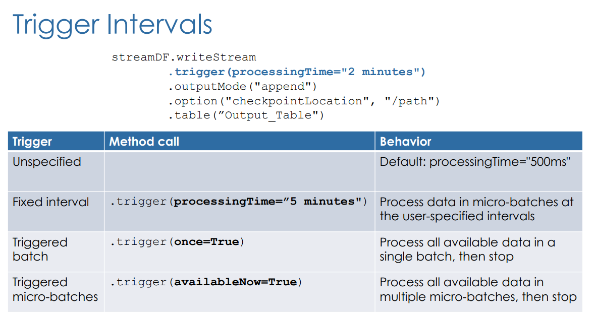
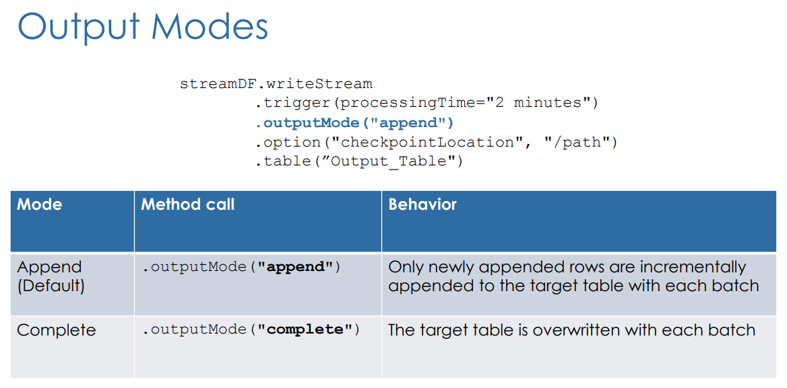
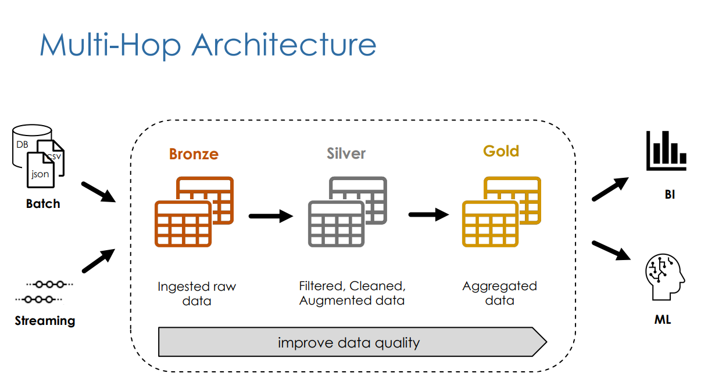
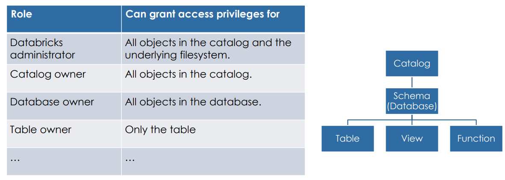

l# DataBricks Learning

## Overview

Databricks is a multi-cloud lake-house platform based on Apache Spark. It aims to achieve the best of both worlds between data warehouses and data lake.
- Data lakes are known to be more open, flexible, and support ML better (as it benefits from raw data).
- Data warehouses are known to be more reliable, has strong governance, and performance very well when queried.
zz

Because it is built off Spark, the compute is done in the memory of multiple nodes in a cluster. it also supports **Batch** and **Stream** Processing, and can work with **Structured**, **Semi-Structured**, and **Unstructured** data.

It supports all languages supported by Spark:
- Scala
- Python
- SQL
- R
- Java

### Layout

Databricks has 3 layers: 

1. Cloud Service: AWS, Azure, GCP etc.
2. Runtime: Apache Spark and Delta Lake
3. Workspace: databricks GUI


### Data resource deployment view

- Control plane: Web UI, Cluster management, Workflows, Notebooks
    - The control plane lives in the Databrick's account,  

- Data plane: cluster of VMs, Storage (DBFS)
    - Compute and storage will always be in the customer's account. DB will provide tool to use and control infrastructure.
    - The data plane lives in the customer's account.
    - Since Apache Spark processes data in distributed manner, DBricks has a native support of a distributed file system. It is just an abstraction layer, in actuality the data is just stored in Cloud Storage (e.g. S3)

***

## Databricks Lakehouse Platform

Delta lake is an open-source software that provides the foundation for storing data and tables in the Databricks. It extends parquet data files with a file-based *transaction log* for ACID transactions and scalable metadata handling. All tables on Databricks are Delta tables unless otherwise specified. 

It is a storage framework that helps data lakes become lake house.

The data held in delta tables are stored in one or more files in parquet format, alongside a **Transaction Log**.


### Delta Lake

### Transaction log

This is a JSON file which has ordered record of every transaction performed on the table. This is the single source of truth. 


### Advanced Delta Lake features

#### Time Travel

In Databricks, every iteration of the table is versioned, this allows you to look back into time of a table.

To see the history of a table:
> DESCRIBE HISTORY

To read the table at a particular point:

- Using timestamp:
    - ```SELECT * FROM my_table TIMESTAMP AS OF "2019-01-01"```

- Using version number:
    - ```SELECT * FROM my_table VERSION AS OF 36``` or
    - ```SELECT * FROM my_table@36```


To rollback:

- RESTORE TABLE:
    - ```RESTORE TABLE my_table TO TIMESTAMP AS OF "2019-01-01"``` or
    - ```RESTORE TABLE my_table TO VERSION AS OF 36```

#### Compaction

You can improve read query speeds by compacting small files into larger ones. 

```
OPTIMIZE my_table
ZORDER BY column_name
```

#### Vacuum

This is a command to help clean up unused files such as:
- Uncommitted files
- Files that are no longer in the latest table state

- VACUUM (default period 7 days):
    - ```VACUUM table_name [*retention period*]```

Note: if you vacuumed, then you cannot perform time travel. 


### Setting up Delta Tables

#### Create Table AS (CTAS)

```
CREATE TABLE new_table
    - **COMMENT** "Contains PII"
    - **PARTITIONED BY** (city, birth_date - should be used in huge files only)
    - **LOCATION** '/some/path'
AS SELECT id, name, email, birth_date, city FROM users
```

#### Table Constraints

- NOT NULL constraints
- CHECK constraints

General format:
```ALTER TABLE table_name ADD CONSTRAINT constraint_name constraint_details```

Example:
```ALTER TABLE orders ADD CONSTRAINT validate CHECK (date > '2020-01-01')```


#### Cloning Delta Lake Tables

NB: Either cloning methods will not affect the source tables.

- Deep Clone:
    - Fully copies date + metadata from a source table to a target, which means that this will take a while. Executing this again will sync the changes.
```
CREATE TABLE table_clone
DEEP CLONE source_table
 ```

- Shadow Clone:
    - Quickly creates a copy of a table by copying over the Delta transaction logs, which means there's no data moving.
```
CREATE TABLE table_clone
SHALLOW CLONE source_table
```

### Setting up Views

Same as views in other databases. 

Types of views: 
1. (Stored) Views: persisted like a table in the database.
    - Dropped only by **DROP VIEW**
    - ```CREATE VIEW view_name AS query```

2. Temporary views: tied to a spark session. It gets dropped when the session ends. 
    - Spark session is created when:
        - Opening a new notebook
        - Detaching and reattaching to a cluster
        - Installing a python package
        - Restarting a cluster
    - ```CREATE TEMP VIEW view_name AS query```

3. Global Temporary views: tied to a cluster. Dropped when a cluster is restarted.
```
CREATE GLOBAL TEMP VIEW view_name AS query
SELECT * FROM global_temp.view_name
```

### Relational entities

#### Databases

In Databricks, a database is a schema in Hive meta-store, therefore:

```
CREATE DATABASE db_name = CREATE SCHEMA db_name
```

Hive meta-store is a repository of metadata, which holds metadata about your table and data.

The default database location is in the default hive directory: *dbfs:/user/hive/warehouse*

You can create databases outside of this using **LOCATION** command.

```
 **LOCATION** 'dbfs:/custom/path/db_y.db
```

The 'db' suffix is what lets us know that it is a database.

#### Tables

There are 2 types of tables:

- Managed tables:
    - Created under the database directory
        - ```CREATE TABLE table_name```
    - The underlying data files will be deleted when dropping the table.

- External tables:
    - Created outside the database directory
        -```CREATE TABLE table_name LOCATION `path` ```
    - The underlying data files will not be deleted when dropping the table.

***

## ELT with Spark SQL and Python

### Querying files


Extract as raw strings - when working with text based files (e.g. JSON, CSV, TSV, and TXT)
- ```SELECT * FROM text.`/path/to/file` ```
- Example JSON:
    - ```SELECT * FROM json.`/path/file_name.json` ```

Extract as raw bytes - when working with images or unstructured data:
- ```SELECT * FROM **binaryFile**.`/path/to/file` ```

To load data from files to tables:

```CREATE TABLE table_name AS SELECT * FROM file_format.`/path/to/file` ```

The table will automatically infer schema information from query results. CTAS are useful for external data ingestion with well-defined schema, but is very limited with options.

That is why we use the normal table creation statement.

```
CREATE TABLE table_name 
(col_name1 col_type1,...)
USING data_source
OPTIONS (key1 = val1,key2=val2,...)
LOCATION = path
```

With these commands we are always create an external table, therefore we are just pointing to files. The tables created are **non-delta tables**. The limitation here is that since it is not a delta table, there is no reliability guarantee.

The solution to this problem is:
1. Create a temporary view using create table method
2. Create a table using CTAS using the temporary view in step 1.

### Writing to tables

When writing to table, there are multiple benefits in overwriting the data, rather than dropping and creating a new table.
Those are:
- The old version of the table still exist, so it can be time travelled to
- It is faster because it does not need to go to the directory recursively or delete any files
- It is an atomic operation, concurrent queries can still read the table as you are overwriting it
- If overwriting table fails, it will be in its table state


#### Overwrite methods

1. 
```
CREATE OR REPLACE TABLE table_name AS
SELECT * FROM date_source.`path`
```

2. Can only overwrite an existing table, it is does not have the risk of change the table schema
```
INSERT OVERWRITE table_name AS
SELECT * FROM data_source.`path`
```

#### Append records to table

1. No built in guarantees for de-duplicating records
```
INSERT INTO table_name
SELECT * FROM data_source.`path`
``` 

2. Guarantee for de-duplication using **MERGE**, example: 
```
MERGE INTO customers c
USING customers_updates u 
ON c.customer_id = u.customer_id
WHEN MATCHED AND c.email IS NULL AND u.email IS NOT NULL THEN
    UPDATE SET email = u.email, updated = u.updated
WHEN NOT MATCHED THEN INSERT *
```

### Advanced transformations

#### Parsing nested JSON  

Spark SQL allows you to traverse/parse JSON file formats and get to the nested values.

e.g.

| profile |
|---|
|{"first_name":"Thomas","last_name":"Lane","gender":"Male","address":{"street":"06 Boulevard Victor Hugo","city":"Paris","country":"France"}}|

```
SELECT customer_id, profile:first_name,profile:address:country
FROM customers
```

Spark also has ability to parse JSON objects into struct type. Struct is a native spark type with nested attributes. Using example above:

```
CREATE OR REPLACE TEMP VIEW parsed_customers AS
    SELECT from_json(profile,schema_of_json('{"first_name":"Thomas","last_name":"Lane","gender":"Male","address":{"street":"06 Boulevard Victor Hugo","city":"Paris","country":"France"}}')) as profile_struct
    FROM customers;

SELECT * FROM parsed_customers
```

You can then query a struct type field with '.' rather than ':'

```
SELECT customers_id, profile_struct.first_name, profile_struct.address.country
FROM parsed_customers
```

You can also flatten the nested fields into columns by using '*'

```
CREATE OR REPLACE TEMP VIEW customers_final AS
    SELECT profile_struct.*
    FROM parsed_customers
```

#### Exploding array of struct type

|Order_id|Customer_id|books|
|---|---|---|
|4243|C00002|[{"book_id":"B07","quantity":1,"subtotal":33},{"book_id":"B06","quantity":1,"subtotal":22}]|

```
SELECT customer_id, explode(books) AS book
FROM orders
```

Outcome:

|Order_id|Customer_id|books|
|---|---|---|
|4243|C00002|[{"book_id":"B07","quantity":1,"subtotal":33}]|
|4243|C00002|[{"book_id":"B06","quantity":1,"subtotal":22}]|

#### Collect_set

Helps us collect unique values for a field, including fields within arrays.

Using above example:

```
SELECT customer_id,
    collect_set(books.book_id)
FROM orders
GROUP BY customer_id 
```

|Order_id|Customer_id|books|
|---|---|---|
|4243|C00002|["B07","B06"]|

We can also use **array_distinct** and **flatten** function with **collect_set** to flatten all of the array within and find the unique values.

#### Joins and Unions

Spark supports standard join operations:
- Inner
- Outer
- Left/Right
- Cross
- Semi

Also these other operations:
- Union
- Intersect (return records found in all involved select statements)
- Minus (return records only found in the first table - kinda of like anti join)
- Pivot (to change other data perspective)


### Higher order functions and SQL UDFs (user defined functions)

Higher order functions help us work with complex data types, such as hierarchical data e.g. arrays and map type objects.

#### FILTER

Filter arrays by using some condition e.g. '>' or '=' etc.

#### TRANSFORM

Apply some sort of transformation for every value in a column for a particular element in the array

#### UDF

Create SQL functions (like python function). UDF are permanent objects and are persisted in the database like tables.

```
CREATE OR REPLACE FUNCTION udf_name(parameter data_type)
RETURNs thing to return
```

```
CREATE OR REPLACE FUNCTION get_url(email string)
RETURNS STRING

RETURN concat("https://www.",split(email,"@")[1])


SELECT email, get_url(email) domain
FROM customers
```

|email|domain|
|---|---|
|thomas.lane@gmail.com|https://www.gmail.com|


You can get more information from running:

```
DESCRIBE FUNCTION udf_name
```
or
```
DESCRIBE FUNCTION EXTENDED udf_name
```

You can return different things by putting **CASE WHEN THEN** statement after the **RETURN** section of the statement. 


***

## Incremental Data Processing

### Structured Streaming

A **Data Stream** is any data source that grows over time.

To process a data stream you can:
1. Reprocess the entire source dataset each time
2. Only process those new data added since last update
    - Structured streaming

Structured stream is create a stream of data from an source (e.g. input table) to a data sink (e.g. output table).
There will be a trigger which will check the input table for any new data.

For the input table:

```
streamDF = spark.readStream
                .table("Input_Table")
```

For the output table:

```
streamDF.writeStream
        .trigger()
        .outputMode()
        .option("checkpointLocation","/path")
        .table("Output_Table")
```

#### .trigger()



#### .outputModes()



#### .option()

- Check pointing
    This stores the state of your streaming in cloud storage so that the status of your streaming can be tracked.
    Checkpoints **cannot** be shared between separate streams. A separate location is needed for every writeStream to ensure processing guarantees.

    - Guarantees
        1. Fault tolerance (checkpointing + write ahead logs):
            These two will record which range of data go progressed during each trigger interval.
            In case of failure, the streaming engine can resume where it left off.

        2. Exactly-once guarantee:
            Idempotent sinks is where multiple writes of the same data do not result in duplicates written to the sink (the output table)
    
    These guarantees are only possible with repeatable data sources.

#### Unsupported Operations

Unsupported:
- Sorted
- De-duplication

Workarounds:
- Windowing
- Watermarking

### Incremental Data Ingestion

The ability to load new files since the last ingestion. We don't want to process the files we have processed before, just the new ones.

There are 2 ways of doing so:
- ```COPY INTO```
    - Thousands of files
    - Less efficient at scale
- Auto loader
    - Millions of files
    - Efficient at scale
    - The recommended when loading from Cloud Object Storage 

#### COPY INTO

This is a SQL command that loads only the new files from the source location when you run it. The files that have been loaded before are just skipped.

Example:
```
COPY INTO my_table
FROM `/path/to/files`
FILEFORMAT = CSV
FORMAT_OPTIONS ('delimiter' = '|',
                'header' = 'true')
COPY_OPTIONS ('mergeSchema'='true')
```

#### Auto loader

Uses structured streaming to process billions of files and support near real time ingestion of millions of files per hour.

Auto loader uses checkpointing to store metadata of the processed files so that files get processed exactly once and also create fault tolerance.

AL in PySparkAPI
```
spark.readStream
        .format('cloudFiles')
        .option('cloudFiles.format',<source_format>)
        .load('/path/to/files')
    .writeStream
        .option('checkpointLocation',<checkpoint_directory>)
        .table(<table_name>)
```

AL can automatically infer the structure of the schema of the source table, and can detect any updates to source structure. If you don't want this cost to happen at every startup of the stream, you can store the inferred schema to be used later. *This location can be the same as the checkpoint location.*

```
spark.readStream
        .format('cloudFiles')
        .option('cloudFiles.format',<source_format>)
        .option('cloudFiles.schemaLocation',<schema_directory>)
        .load('/path/to/files')
    .writeStream
        .option('checkpointLocation',<checkpoint_directory>)
        .option('mergeSchema','true')
        .table(<table_name>)
```

### Multi-Hop Architecture (aka Medallion Architecture)

Medallion Architecture is used to logically organise data in a lakehouse, with a goal of incrementally improving the structure and quality of data as it flows through each layer (bronze->silver->gold) of the architecture.



It is a simple data model that enables incremental ETL and can combine streaming and batch workloads in one pipeline. You can recreate your tables from raw data any time.

#### Bronze

Data as is, but include metadata columns such as load date/time, process ID, etc.

The purpose of this layer is quick Change Data Capture (the process of identifying and capturing changes made to data in database and then delivering those changes in real-time to a downstream process or system), provide archive/cold storage, data lineage, audit-ability, reprocessing if needed without rereading the data from the source system (effectively being source data).

#### Silver

Data in **Silver** layer is the data from **Bronze** layer matched, merged, conformed, and cleansed (just enough) so that this layer can provide an "Enterprise View" of all its key business entities, concepts, and transactions (e.g. master customers, stores etc.)

***

## Production Pipelines

### Delta Live Tables (DLT)

DLT is a framework for building reliable and maintainable data processing pipelines, it provides a Directed Acyclic Graph (DAG) that shows your multi-hop architecture and it's dependencies. They are created by using databricks notebooks. So therefore, instead of using a series of separate Apache Spark tasks, you define the tables you need and DLT manages it for you depending on your input configurations.

- DLT tables will always be proceeded by `LIVE` keyword
- Incremental processing via auto loader needs `STREAMING` keyword
- Comment is visible to anyone exploring the data catalog

#### Creating new pipeline

Click "Workflows" > select "Delta Live Tables" tab > "Create pipeline"

#### Bronze tables

```
CREATE OR REFRESH STREAMING LIVE TABLE orders_raw
COMMENT "The raw books orders, ingested from orders-raw"
AS SELECT * FROM cloud_files("${datasets_path}/orders-json-raw", "json",
                             map("cloudFiles.inferColumnTypes", "true"))
```

```
CREATE OR REFRESH LIVE TABLE customers
COMMENT "The customers lookup table, ingested from customers-json"
AS SELECT * FROM json.`${datasets_path}/customers-json`
```

#### Silver tables

```
CREATE OR REFRESH STREAMING LIVE TABLE orders_cleaned (
  CONSTRAINT valid_order_number EXPECT (order_id IS NOT NULL) ON VIOLATION DROP ROW
)
COMMENT "The cleaned books orders with valid order_id"
AS
  SELECT order_id, quantity, o.customer_id, c.profile:first_name as f_name, c.profile:last_name as l_name,
         cast(from_unixtime(order_timestamp, 'yyyy-MM-dd HH:mm:ss') AS timestamp) order_timestamp, o.books,
         c.profile:address:country as country
  FROM STREAM(LIVE.orders_raw) o
  LEFT JOIN LIVE.customers c
    ON o.customer_id = c.customer_id
```

Definition and rules:

A **streaming table** is a Delta Table with extra support for streaming or incremental data processing by allowing you to process a growing dataset, handling each row only once. These tables are designed to need data sources that are append-only.

A **materialized view** is a live table in Databricks. These views are refreshed according to the update schedule of the pipeline in which they are contained. DLT abstracts away complexities associated with dealing with sheduling. They are powerful because they can handle changes in the source.


- Table references:
    - `LIVE` keyword must be used to refer to other DLT tables (e.g. `LIVE.table_name`)
    - `STREAMING` keyword must be used to refer to streaming tables (e.g. `STREAM(LIVE.table_name)`)

- `ON VIOLATION` constraints:
    - `DROP ROW`: discards records that violates constraints
    - `FAIL UPDATE`: violation causes pipeline to fail
    - `OMITTED`: violation records will be kept but reported in metrics

#### Gold tables

```
CREATE OR REFRESH LIVE TABLE cn_daily_customer_books
COMMENT "Daily number of books per customer in China"
AS
  SELECT customer_id, f_name, l_name, date_trunc("DD", order_timestamp) order_date, sum(quantity) books_counts
  FROM LIVE.orders_cleaned
  WHERE country = "China"
  GROUP BY customer_id, f_name, l_name, date_trunc("DD", order_timestamp)
```

### Change Data Capture (CDC)

CDC is the process of identifying what has changed in the source and delivering these changes to the target. The changes to be delivered are called CDC feed.zxc

Changes could be:
- Inserting new data
- Updating existing data
- Deleting existing data

Changes are logged at the source as events that contain both data and metadata information (e.g. the data and also columns describing the change and timestamp)

#### CDC with Delta Live Tables

```
APPLY CHANGES INTO LIVE.target_table
FROM STREAM(LIVE.cdc_feed_table)
KEYS (key_field)
APPLY AS DELETE WHEN operation_field = "DELETE"
SEQUENCE BY sequence_field
COLUMNS * [EXCEPT (column_name,...)]
```

- APPLY CHANGES INTO command
    - target_table = the table which will be receiving the feed and updating it's data. *This table needs to be create already before executing command.*
    - key_field = primary keys; if key exists in target table, it'll be updated, if not then inserted
    - APPLY AS DELETE WHEN = specifies when records should be deleted 
    - sequence_field = 
    - COLUMNS = all the columns that are going to flow through to the target table

|Pros|Cons|
|---|---|
|Automatically orders late arriving records using the KEYS provided. Updates and deletions from upstream will be reflected downstream computations.|Since data is being updated and deleted in the target table, this breaks the append-only requirements for streaming table sources. This means we cannot use this target table as a source in the next layer|
|The default is 'upsert'||
|Can optionally appy deletes||
|Specify one or more fields as primary key||
|EXCEPT keyword to specify which columns to ignore||
|Support SCD Type 1 (default) and SCD Type 2||

**DLT VIEWS can reference other tables created in other notebooks**

### Jobs

A Databricks job is a way to run your data processing and analysis applications in a Databricks workspace. Your job can consist of a single task or can be a large, multi-task workflow with complex dependencies. Databricks manages the task orchestration, cluster management, monitoring, and error reporting for all of your jobs. You can run your jobs immediately, periodically through an easy-to-use scheduling system, whenever new files arrive in an external location, or continuously to ensure an instance of the job is always running. You can also run jobs interactively in the notebook UI.

### Databricks SQL (DB SQL)

DB SQL is a serverless datawarehouse on the Databricks Lakehouse Platform, it has an in-platform SQL editor and dashboard tools allowing collborations. 

It's a way to use it like a SQL Server or Synapse, without having to go through notebooks. 

***

## Data Object Privileges

You can programtically set and alter prvileges.

```
GRANT privilege ON object <object_name> TO <user or group>
```

Example:
```
GRANT SELECT ON TABLE my_table TO user_1@company.com
```

operations are:
- GRANT 
- DENY
- REVOKE 
- SHOW GRANTS

`privilege` consists of:
- SELECT: read access to an object
- MODIFY: add, delete, and modigy data to or from an object
- CREATE: create an object
- READ_METADATA: view an object and its metadata
- USAGE: no effect, required to perform any action on a database object
- ALL PRIVILEGES: self explanatory

`object` specifies access to:
- CATALOG: to entire catalog
- SCHEMAL: to database
- TABLE: to managed or external table
- VIEW: to SQL view
- FUNCTION: to named function
- ANY FILE: to underlying filesystem

#### Granting privileges by role




### Unity Catalog

Unity catalog is a SQL based centralised governance solution across all your workspaces on any cloud. It provides unified governance for all data and AI assets including:
- files,
- tables,
- machine leaning models,
- and dashboards

#### Architecture


This architecture means that Unity Catalog sits outside of the workspace and all user/group management, metastores, and access controls are managed through the account console.

A UC metastore can be assigned to more than one workspace, enabling multiple workspaces to share the same DBFS storage and same access control list.

Traditional namespace
```
SELECT * FROM schema.table
```

Databricks namespace
```
SELECT * FROM catalog.schema.table
```


#### Hierarchy

The UC Metasotre is the top level container in the unity catalog. It contains information about the objects managed by the metastore and also the access control list that govern access to those objects.

$Unity Metastore ≠ Hive Metastore$

