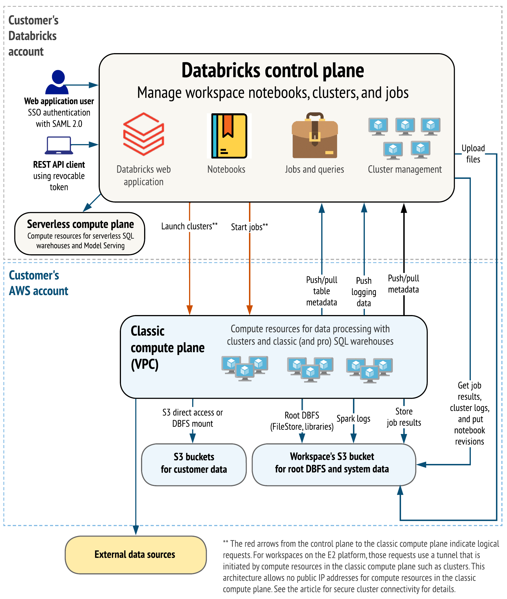
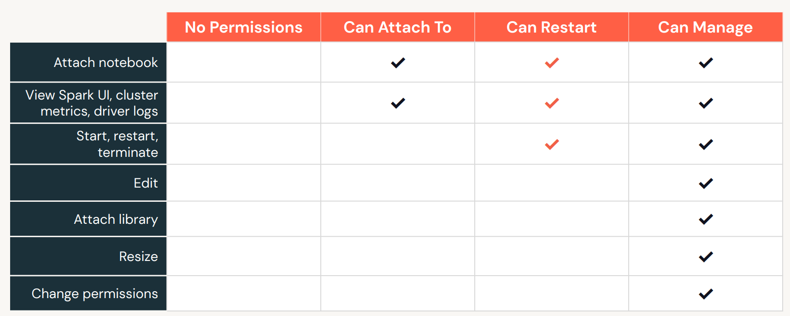
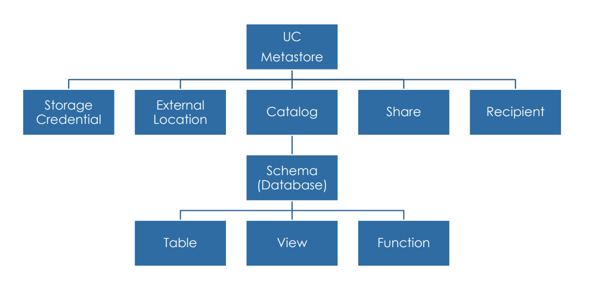
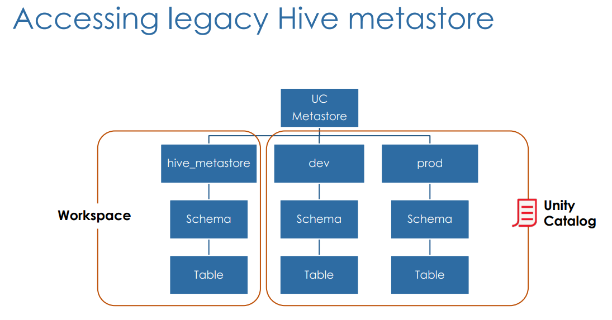

l# DataBricks Learning

## Overview

Databricks is a multi-cloud lake-house platform based on Apache Spark. It aims to achieve the best of both worlds between data warehouses and data lake.
- Data lakes are known to be more open, and flexible, and support ML better (as it benefits from raw data).
- Data warehouses are known to be more reliable, have strong governance, and performance very well when queried.

Because it is built off Spark, the computing is done in the memory of multiple nodes in a cluster. it also supports **Batch** and **Stream** Processing, and can work with **Structured**, **Semi-Structured**, and **Unstructured** data.

It supports all languages supported by Spark:
- Scala
- Python
- SQL
- R
- Java

### Layout

Databricks has 3 layers: 

1. Cloud Service: AWS, Azure, GCP etc.
2. Runtime: Apache Spark and Delta Lake
3. Workspace: Databricks GUI




### Data resource deployment view

- Control plane: Web UI, Cluster management, Workflows, Notebooks
    - The control plane lives in the Databrick's account,  

- Data plane: cluster of VMs, Storage (DBFS)
    - Compute and storage will always be in the customer's account. DB will provide a tool to use and control infrastructure.
    - The data plane lives in the customer's account.
    - Since Apache Spark processes data in a distributed manner, DBricks has native support of a distributed file system. It is just an abstraction layer, in actuality the data is just stored in Cloud Storage (e.g. S3)


### Notebooks

Notebooks are common tools in data science and ML for developing code and presenting results. This is the case so in Databricks as well.

It provides:
- Real-time coauthoring in multiple languages, automatic versioning, and built0in data visualisations. 


***

## Databricks Lake-house Platform

Delta lake is an open-source software that provides the foundation for storing data and tables in Databricks. It extends parquet data files with a file-based *transaction log* for ACID transactions and scalable metadata handling. All tables on Databricks are Delta tables unless otherwise specified. 

It is a storage framework that helps data lakes become lake house.

The data held in delta tables are stored in one or more files in parquet format, alongside a **Transaction Log**.

### Delta Lake

### Transaction log

This JSON file has ordered records of every transaction performed on the table. This is the single source of truth. 

### Advanced Delta Lake features

#### Time Travel

In Databricks, every iteration of the table is versioned, this allows you to look back in time of a table.

To see the history of a table:
> DESCRIBE HISTORY

To read the table at a particular point:

- Using timestamp:
    - ```SELECT * FROM my_table TIMESTAMP AS OF "2019-01-01"```

- Using version number:
    - ```SELECT * FROM my_table VERSION AS OF 36``` or
    - ```SELECT * FROM my_table@36```


To rollback:

- RESTORE TABLE:
    - ```RESTORE TABLE my_table TO TIMESTAMP AS OF "2019-01-01"``` or
    - ```RESTORE TABLE my_table TO VERSION AS OF 36```

#### Compaction

You can improve read query speeds by compacting small files into larger ones. 

```
OPTIMIZE my_table
ZORDER BY column_name
```

#### Vacuum

This is a command to help clean up unused files such as:
- Uncommitted files
- Files that are no longer in the latest table state

- VACUUM (default period 7 days):
    - ```VACUUM table_name [*retention period*]```

Note: if you vacuumed, then you cannot perform time travel. 


### Setting up Delta Tables

#### Create Table AS (CTAS)

```
CREATE TABLE new_table
    - **COMMENT** "Contains PII"
    - **PARTITIONED BY** (city, birth_date - should be used in huge files only)
    - **LOCATION** '/some/path'
AS SELECT id, name, email, birth_date, city FROM users
```

*If table created is from another table, then the new table schema adopts the source table. If it is from a file then the new table infers the schema after scanning.*

#### Table Constraints

- NOT NULL constraints
- CHECK constraints

General format:
```ALTER TABLE table_name ADD CONSTRAINT constraint_name constraint_details```

Example:
```ALTER TABLE orders ADD CONSTRAINT validate CHECK (date > '2020-01-01')```


#### Cloning Delta Lake Tables

NB: Either cloning methods will not affect the source tables.

- Deep Clone:
    - Fully copies date + metadata from a source table to a target, which means that this will take a while. Executing this again will sync the changes.
```
CREATE TABLE table_clone
DEEP CLONE source_table
 ```

- Shadow Clone:
    - Quickly creates a copy of a table by copying over the Delta transaction logs, which means there's no data moving.
```
CREATE TABLE table_clone
SHALLOW CLONE source_table
```

### Setting up Views

Same as views in other databases. 

Types of views: 
1. (Stored) Views: persisted like a table in the database.
    - Dropped only by **DROP VIEW**
    - ```CREATE VIEW view_name AS query```

2. Temporary views: tied to a spark session. It gets dropped when the session ends. 
    - Spark session is created when:
        - Opening a new notebook
        - Detaching and reattaching to a cluster
        - Installing a python package
        - Restarting a cluster
    - ```CREATE TEMP VIEW view_name AS query```

3. Global Temporary views: tied to a cluster. Dropped when a cluster is restarted.
```
CREATE GLOBAL TEMP VIEW view_name AS query
SELECT * FROM global_temp.view_name
```

### Relational entities

#### Databases

In Databricks, a **database** is a **schema** in Hive meta-store, therefore:

```
CREATE DATABASE db_name = CREATE SCHEMA db_name
```

Hive meta-store is a repository of metadata, which holds metadata about your table and data.

The default database location is in the default hive directory: *dbfs:/user/hive/warehouse*

You can create databases outside of this using **LOCATION** command.

```
CREATE SCHEMA db_y
LOCATION `dbfs:/custom/path/db_y.db`

USE db_y;
CREATE TABLE table1 
CREATE TABLE table2
```
The 'db' suffix is what lets us know that it is a database.

#### Tables

There are 2 types of tables:

- Managed tables:
    - Created under the database directory
        - ```CREATE TABLE table_name```
    - The underlying data files will be deleted when dropping the table.

- External tables:
    - Created outside the database directory
        -```CREATE TABLE table_name LOCATION `path` ```
    - **The underlying data files will not be deleted when dropping the table.**


### Clusters

#### Types

- All-purpose
    - These serve the notebooks
    - You can create these from the Workspace or using APIs
    - Up to 70 clusters can be retained for up to 30 days
- Job Cluster
    - These ones are spun up by Databricks Job Scheduler when running automated jobs
    - Information up to the 30 most recent terminated clusters are retained

#### Modes
Cluster modes:
- Standard (multi-node): requires at least 2 VM instances
- Single node: low-cost single instance cluster

#### Databricks runtime versions
- Standard: Apache Spark and other components, optimised for big data analytics
- Machine learning: Adds popular ML libraries (e.g.TensorFlow, Keras, PyTorch, and XGBoost)
- Photon: Optional add on to optimise SQL workloads

#### Access

|Mode|Visible to user|Unity Catalog Support|Supported Languages|
|---|---|---|---|
|Single User|Always|Yes|Python, SQL, Scala, R|
|Shared|Always (Premium planed required) - there are certain things disabled|Yes|Python (DBR11.1+),SQL|
|No Isolation shared|Can be hidden through config|No|Python, SQL, Scala, R|
|Custom|Only shown for existing clusters without access modes (i.e. legacy cluster modes, Standard or High Concurrency); not an option for creating new clusters|No|^^|


#### Policies

Cluster policies can:
- Standardise cluster configs
- Provide templates for configs
- Prevent excessive use and control cost
- Enforce correct tagging



***

## ELT with Spark SQL and Python

### Querying files


Extract as raw strings - when working with text-based files (e.g. JSON, CSV, TSV, and TXT)
- ```SELECT * FROM text.`/path/to/file` ```
- Example JSON:
    - ```SELECT * FROM json.`/path/file_name.json` ```

Extract as raw bytes - when working with images or unstructured data:
- ```SELECT * FROM **binaryFile**.`/path/to/file` ```

To load data from files to tables:

```CREATE TABLE table_name AS SELECT * FROM file_format.`/path/to/file` ```

The table will automatically infer schema information from query results. CTAS are useful for external data ingestion with well-defined schema but is very limited with options.

That is why we use the normal table creation statement.

```
CREATE TABLE table_name 
(col_name1 col_type1,...)
USING data_source
OPTIONS (key1 = val1,key2=val2,...)
LOCATION = path
```

With these commands we always create an external table, therefore we are just pointing to files. The tables created are **non-delta tables**. The limitation here is that since it is not a delta table, there is no reliability guarantee.

The solution to this problem is:
1. Create a temporary view using the create table method
2. Create a table using CTAS using the temporary view in step 1.

### Writing to tables

When writing to a table, there are multiple benefits in overwriting the data, rather than dropping and creating a new table.
Those are:
- The old version of the table still exists, so it can be time travelled to
- It is faster because it does not need to go to the directory recursively or delete any files
- It is an atomic operation, concurrent queries can still read the table as you are overwriting it
- If overwriting the table fails, it will be in its table state


#### Overwrite methods

1. 
```
CREATE OR REPLACE TABLE table_name AS
SELECT * FROM date_source.`path`
```

2. Can only overwrite an existing table, it does not have the risk of changing the table schema
```
INSERT OVERWRITE table_name AS
SELECT * FROM data_source.`path`
```

#### Append records to table

1. No built-in guarantees for de-duplicating records
```
INSERT INTO table_name
SELECT * FROM data_source.`path`
``` 

2. Guarantee for de-duplication using **MERGE**, for example: 
```
MERGE INTO customers c
USING customers_updates u 
ON c.customer_id = u.customer_id
WHEN MATCHED AND c.email IS NULL AND u.email IS NOT NULL THEN
    UPDATE SET email = u.email, updated = u.updated
WHEN NOT MATCHED THEN INSERT *
```

### Advanced transformations

#### Parsing nested JSON  

Spark SQL allows you to traverse/parse JSON file formats and get to the nested values.

e.g.

| profile |
|---|
|{"first_name":"Thomas","last_name":"Lane","gender":"Male","address":{"street":"06 Boulevard Victor Hugo","city":"Paris","country":"France"}}|

```
SELECT customer_id, profile:first_name,profile:address:country
FROM customers
```

Spark also has the ability to parse JSON objects into struct type. Struct is a native spark type with nested attributes. Using example above:

```
CREATE OR REPLACE TEMP VIEW parsed_customers AS
    SELECT from_json(profile,schema_of_json('{"first_name":"Thomas","last_name":"Lane","gender":"Male","address":{"street":"06 Boulevard Victor Hugo","city":"Paris","country":"France"}}')) as profile_struct
    FROM customers;

SELECT * FROM parsed_customers
```

You can then query a struct type field with '.' rather than ':'

```
SELECT customers_id, profile_struct.first_name, profile_struct.address.country
FROM parsed_customers
```

You can also flatten the nested fields into columns by using '*'

```
CREATE OR REPLACE TEMP VIEW customers_final AS
    SELECT profile_struct.*
    FROM parsed_customers
```

#### Exploding array of struct type

|Order_id|Customer_id|books|
|---|---|---|
|4243|C00002|[{"book_id":"B07","quantity":1,"subtotal":33},{"book_id":"B06","quantity":1,"subtotal":22}]|

```
SELECT customer_id, explode(books) AS book
FROM orders
```

Outcome:

|Order_id|Customer_id|books|
|---|---|---|
|4243|C00002|[{"book_id":"B07","quantity":1,"subtotal":33}]|
|4243|C00002|[{"book_id":"B06","quantity":1,"subtotal":22}]|

#### Collect_set

It helps us collect unique values for a field, including fields within arrays.

Using the above example:

```
SELECT customer_id,
    collect_set(books.book_id)
FROM orders
GROUP BY customer_id 
```

|Order_id|Customer_id|books|
|---|---|---|
|4243|C00002|["B07","B06"]|

We can also use **array_distinct** and **flatten** functions with **collect_set** to flatten all of the array within and find the unique values.

#### Joins and Unions

Spark supports standard join operations:
- Inner
- Outer
- Left/Right
- Cross
- Semi

Also these other operations:
- Union
- Intersect (return records found in all involved select statements)
- Minus (return records only found in the first table - kinda of like anti-join)
- Pivot (to change other data perspective)


### Higher-order functions and SQL UDFs (user-defined functions)

Higher-order functions help us work with complex data types, such as hierarchical data e.g. arrays and map type objects.

#### FILTER

Filter arrays by using some condition e.g. '>' or '=' etc.

#### TRANSFORM

Apply some transformation for every value in a column for a particular element in the array

#### UDF

Create SQL functions (like Python functions). UDF are permanent objects and are persisted in the database like tables.

```
CREATE OR REPLACE FUNCTION udf_name(parameter data_type)
RETURNs thing to return
```

```
CREATE OR REPLACE FUNCTION get_url(email string)
RETURNS STRING

RETURN concat("https://www.",split(email,"@")[1])


SELECT email, get_url(email) domain
FROM customers
```

|email|domain|
|---|---|
|thomas.lane@gmail.com|https://www.gmail.com|


You can get more information from running:

```
DESCRIBE FUNCTION udf_name
```
or
```
DESCRIBE FUNCTION EXTENDED udf_name
```

You can return different things by putting **CASE WHEN THEN** statement after the **RETURN** section of the statement. 


***

## Incremental Data Processing

### Structured Streaming

A **Data Stream** is any data source that grows over time.

To process a data stream you can:
1. Reprocess the entire source dataset each time
2. Only process the new data added since the last update
    - Structured streaming

A structured stream creates a stream of data from a source (e.g. input table) to a data sink (e.g. output table).
There will be a trigger which will check the input table for any new data.

For the input table:

```
streamDF = spark.readStream
                .table("Input_Table")
```

For the output table:

```
streamDF.writeStream
        .trigger()
        .outputMode()
        .option("checkpointLocation","/path")
        .table("Output_Table")
```

#### .trigger()


#### .outputModes()


#### .option()

- Checkpointing
    This stores the state of your streaming in cloud storage so that the status of your streaming can be tracked.
    Checkpoints **cannot** be shared between separate streams. A separate location is needed for every writeStream to ensure processing guarantees.

    - Guarantees
        1. Fault tolerance (checkpointing + write ahead logs):
            These two will record which range of data progressed during each trigger interval.
            In case of failure, the streaming engine can resume where it left off.

        2. Exactly-once guarantee:
            Idempotent sinks are where multiple writes of the same data do not result in duplicates written to the sink (the output table)
    
    These guarantees are only possible with repeatable data sources.

#### Unsupported Operations

Unsupported:
- Sorted
- De-duplication

Workarounds:
- Windowing
- Watermarking

### Incremental Data Ingestion

The ability to load new files since the last ingestion. We don't want to process the files we have processed before, just the new ones.

There are 2 ways of doing so:
- ```COPY INTO```
    - Thousands of files
    - Less efficient at scale
- Autoloader
    - Millions of files
    - Efficient at scale
    - The recommended when loading from Cloud Object Storage 

#### COPY INTO

This is an SQL command that loads only the new files from the source location when you run it. The files that have been loaded before are just skipped.

Example:
```
COPY INTO my_table
FROM `/path/to/files`
FILEFORMAT = CSV
FORMAT_OPTIONS ('delimiter' = '|',
                'header' = 'true')
COPY_OPTIONS ('mergeSchema'='true')
```

#### Auto loader

AL is based on Spark Structured Streaming to process billions of files and supports near real-time ingestion of millions of files per hour as they arrive in **cloud storage**. 

Autoloader uses checkpointing (RocksDB, embedded database for key-value storage) to store metadata of the processed files so that files get processed exactly once and also create fault tolerance.

**The inclusion of `.format('cloudFiles')' enables the use of Autoloader.**

AL in PySparkAPI
```
spark.readStream
        .format('cloudFiles')
        .option('cloudFiles.format',<source_format>)
        .load('/path/to/files')
    .writeStream
        .option('checkpointLocation',<checkpoint_directory>)
        .table(<table_name>)
```

AL can automatically infer the structure of the schema of the source table and can detect any updates to the source structure. If you don't want this cost to happen at every startup of the stream, you can store the inferred schema to be used later. **This location can be the same as the checkpoint location.**

```
spark.readStream
        .format('cloudFiles')
        .option('cloudFiles.format',<source_format>)
        .option('cloudFiles.schemaLocation',<schema_directory>)
        .load('/path/to/files')
    .writeStream
        .option('checkpointLocation',<checkpoint_directory>)
        .option('mergeSchema','true')
        .table(<table_name>)
```

### Multi-Hop Architecture (aka Medallion Architecture)

Medallion Architecture is used to logically organise data in a lakehouse, with the goal of incrementally improving the structure and quality of data as it flows through each layer (bronze->silver->gold) of the architecture.


It is a simple data model that enables incremental ETL and can combine streaming and batch workloads in one pipeline. You can recreate your tables from raw data at any time.

#### Bronze (raw)

Data as is, but include metadata columns such as load date/time, process ID, etc.

The purpose of this layer is quick Change Data Capture (the process of identifying and capturing changes made to data in the database and then delivering those changes in real-time to a downstream process or system), provide archive/cold storage, data lineage, audit-ability, reprocessing if needed without rereading the data from the source system (effectively being source data).

#### Silver (cleansed and conformed data)

Data in **Silver** layer is the data from **Bronze** layer matched, merged, conformed, and cleansed (just enough) so that this layer can provide an "Enterprise View" of all its key business entities, concepts, and transactions (e.g. master customers, stores etc.)

At this layer you are providing clean foundational data that enables self service, and serves as the source of analysts, Data Engineers, and Data Scientists to create their projects. This is layer should provide an "Enterprise VIew".  


#### Gold (curated business-level tables)

***

## Production Pipelines

### Delta Live Tables (DLT)

DLT is a framework for building reliable and maintainable data processing pipelines, it provides a Directed Acyclic Graph (DAG) that shows your multi-hop architecture and its dependencies. They are created by using Databricks notebooks. Therefore, instead of using a series of separate Apache Spark tasks, you define the tables you need and DLT manages them for you depending on your input configurations.

- DLT tables will always be proceeded by `LIVE` keyword
- Incremental processing via autoloader needs `STREAMING` keyword
- Comment is visible to anyone exploring the data catalog

#### Creating new pipeline

Click "Workflows" > select "Delta Live Tables" tab > "Create pipeline"

#### Bronze tables

```
CREATE OR REFRESH STREAMING LIVE TABLE orders_raw
COMMENT "The raw books orders, ingested from orders-raw"
AS SELECT * FROM cloud_files("${datasets_path}/orders-json-raw", "json",
                             map("cloudFiles.inferColumnTypes", "true"))
```

```
CREATE OR REFRESH LIVE TABLE customers
COMMENT "The customers lookup table, ingested from customers-json"
AS SELECT * FROM json.`${datasets_path}/customers-json`
```

#### Silver tables

```
CREATE OR REFRESH STREAMING LIVE TABLE orders_cleaned (
  CONSTRAINT valid_order_number EXPECT (order_id IS NOT NULL) ON VIOLATION DROP ROW
)
COMMENT "The cleaned books orders with valid order_id"
AS
  SELECT order_id, quantity, o.customer_id, c.profile:first_name as f_name, c.profile:last_name as l_name,
         cast(from_unixtime(order_timestamp, 'yyyy-MM-dd HH:mm:ss') AS timestamp) order_timestamp, o.books,
         c.profile:address:country as country
  FROM STREAM(LIVE.orders_raw) o
  LEFT JOIN LIVE.customers c
    ON o.customer_id = c.customer_id
```

#### Gold tables

```
CREATE OR REFRESH LIVE TABLE cn_daily_customer_books
COMMENT "Daily number of books per customer in China"
AS
  SELECT customer_id, f_name, l_name, date_trunc("DD", order_timestamp) order_date, sum(quantity) books_counts
  FROM LIVE.orders_cleaned
  WHERE country = "China"
  GROUP BY customer_id, f_name, l_name, date_trunc("DD", order_timestamp)
```

Definition and rules:

A **streaming table** is a Delta Table with extra support for streaming or incremental data processing by allowing you to process a growing dataset, handling each row only once. These tables are designed to need data sources that are append-only.

A **materialized view** is a live table in Databricks. These views are refreshed according to the update schedule of the pipeline in which they are contained. DLT abstracts away complexities associated with dealing with scheduling. They are powerful because they can handle changes in the source.


- Table references:
    - `LIVE` keyword must be used to refer to other DLT tables (e.g. `LIVE.table_name`)
    - `STREAMING` keyword must be used to refer to streaming tables (e.g. `STREAM(LIVE.table_name)`)

- `ON VIOLATION` constraints:
    - ` `: if you don't provide a violation result, records will be kept but reported in event log. This is the default. 
    - `DROP ROW`: discards records that violate constraints
    - `FAIL UPDATE`: violation causes pipeline to fail


#### Development vs Production

There is a toggle in the UI for DLT which controls whether your pipeline updates runs in development or in production mode. Toggle to development when deploying to dev environment and to production when deploying to a production environment.

In development mode:
- The compute resources does not get immediately terminated after a update succeeds or fails. The same compute can be reused to make multiple updates of the pipeline without waiting for a cluster to start
- It does not automatically retry task failure, allow you to immediately detect and fix logical or syntactic errors in your pipeline. 

### Change Data Capture (CDC)

CDC is the process of identifying what has changed in the source and delivering these changes to the target. The changes to be delivered are called CDC feed.

Changes could be:
- Inserting new data
- Updating existing data
- Deleting existing data

Changes are logged at the source as events that contain both data and metadata information (e.g. the data and columns describing the change and timestamp)

#### CDC with Delta Live Tables

```
APPLY CHANGES INTO LIVE.target_table
FROM STREAM(LIVE.cdc_feed_table)
KEYS (key_field)
APPLY AS DELETE WHEN operation_field = "DELETE"
SEQUENCE BY sequence_field
COLUMNS * [EXCEPT (column_name,...)]
```

- APPLY CHANGES INTO command
    - target_table = the table which will be receiving the feed and updating its data. *This table needs to be created already before executing the command.*
    - key_field = primary keys; if the key exists in the target table, it'll be updated, if not then inserted
    - APPLY AS DELETE WHEN = specifies when records should be deleted 
    - sequence_field = 
    - COLUMNS = all the columns that are going to flow through to the target table

|Pros|Cons|
|---|---|
|Automatically orders late-arriving records using the KEYS provided. Updates and deletions from upstream will be reflected in downstream computations.|Since data is being updated and deleted in the target table, this breaks the append-only requirements for streaming table sources. This means we cannot use this target table as a source in the next layer|
|The default is 'upsert'||
|Can optionally apply deletes||
|Specify one or more fields as primary key||
|EXCEPT keyword to specify which columns to ignore||
|Support SCD Type 1 (default) and SCD Type 2||

**DLT VIEWS can reference other tables created in other notebooks**

### Jobs

A Databricks job is a way to run your data processing and analysis applications in a Databricks workspace. Your job can consist of a single task or can be a large, multi-task workflow with complex dependencies. Databricks manages the task orchestration, cluster management, monitoring, and error reporting for all of your jobs. You can run your jobs immediately, periodically through an easy-to-use scheduling system, whenever new files arrive in an external location, or continuously to ensure an instance of the job is always running. You can also run jobs interactively in the notebook UI.

#### Email and System notification

You can configure job events (starts, completes, fails, exceeds duration)to send notifications to you.

You can configure it to send emails to particular individuals. It can also integrate with tools such as:
- Slack
- PagerDuty
- Microsoft Teams 
- HTTP webhook


### Databricks SQL (DB SQL)

DB SQL is a serverless data warehouse on the Databricks Lakehouse Platform, it has an in-platform SQL editor and dashboard tools allowing collaborations. 

It's a way to use it like a SQL Server or Synapse, without having to go through notebooks. 

***

## Data Governance

### Data Object Privileges

You can programmatically set and alter privileges.

```
GRANT privilege ON object <object_name> TO <user or group>
```

Example:
```
GRANT SELECT ON TABLE my_table TO user_1@company.com
```

operations are:
- GRANT 
- DENY
- REVOKE 
- SHOW GRANTS

`privilege` consists of:
- SELECT: read access to an object
- MODIFY: add, delete, and modify data to or from an object
- CREATE: create an object
- READ_METADATA: view an object and its metadata
- USAGE: no effect, required to perform any action on a database object
- ALL PRIVILEGES: self-explanatory

`object` specifies access to:
- CATALOG: to the entire catalog
- SCHEMAL: to database
- TABLE: to manage or external table
- VIEW: to SQL view
- FUNCTION: to named function
- ANY FILE: to the underlying filesystem

#### Granting privileges by role


### Unity Catalog

Unity catalog is a SQL-based centralised governance solution across all your workspaces on any cloud. It provides unified governance for all data and AI assets including:
- files,
- tables,
- machine learning models,
- and dashboards

#### Architecture


This architecture means that Unity Catalog sits outside of the workspace and all user/group management, meta stores, and access controls are managed through the account console.

A UC meta store can be assigned to more than one workspace, enabling multiple workspaces to share the same DBFS storage and same access control list.

Traditional namespace
```
SELECT * FROM schema.table
```

Databricks namespace
```
SELECT * FROM catalog.schema.table
```


#### Hierarchy

The UC Metastore is the top-level container in the unity catalog. It contains information about the objects managed by the meta store and also the access control list that govern access to those objects.

**Unity Metastore ≠ Hive Metastore**

Hive meta store is the default meta store linked to each Databricks workspace, Unity Catalog metastore offers improved security and advanced features. It's like a more powerful version of Hive meta store. Hive meta store is sometime considered "legacy"




#### Identities

There are 3 types of identities/principals in Unity Catalog:
- Users: are individual physical users who are identified by email addresses.
- Service Principals: individual entities for automated tools and systems like scripts, apps, and CICD platforms. They are uniquely identified by Application ID.
    - Databricks recommends using a service principal and its OAuth token or personal access token instead of your Databricks user account and personal access token.
- Groups: grouping Users and Service Principals.


#### Identity Federation

Identities exist at two levels: account and workspace-level

Unity Catalog supports Identity Federation, which means you create it in the account console once and it can be assigned to one or more workspaces as necessary.

#### Privileges

|Privilege||
|---|---|
|CREATE, USAGE, SELECT, MODIFY |Same as hive metastore|
|READ FILE, WRITE FILE|Replaces ANY FILE privilege in hive metastore|
|EXECUTE|Allow executing UDFs|

#### Security Model Summary


Unity Catalog is additive, meaning your legacy Hive meta store is still accessible once Unity Catalog is enabled. You can access it as a *hive_metastore* catalog regardless of the Unity Catalog assigned to the workspace. 



#### Other features

Other than a centralised governance for data and AI, Unity Catalog has a built-in data search and discovery. It lets you tag and document data assets and provides a search interface to help users find data.

It also provides automated lineage where you can identify the origin of your data and where it is used by capturing and using user-level audit logs that record access to data.

