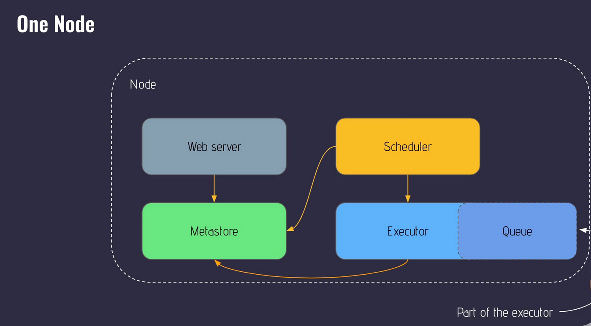
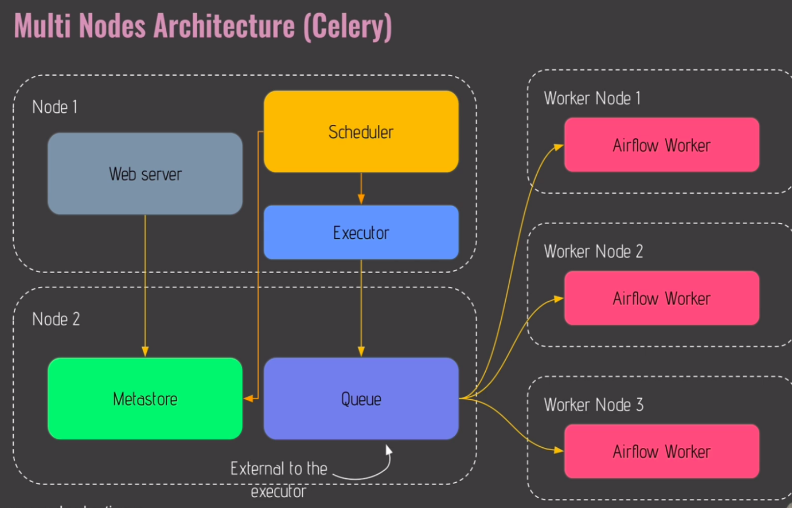

# Airflow

Airflow is a orchestrator. It is currently not a streaming solution and is not a data processing framework in a sense you shouldn't process anything in Airflow, you just use it to trigger other tools which will do so.

## Core Components

### Web Server

Flask Python web server that's a User Interface.

### Scheduler

Handles triggering tasks and pipelines. Important this works or else nothing works. 

### Metastore

A database that is compatible with SQL, e.g. Postgres, MySQL, Oracle etc. 

This database will have metadata related to your data, pipelines, tasks, airflow users etc.

### Triggerer

Allows the running of specific type of tasks...

TODO

### Executor

How and on which support tasks are executed, e.g. Kubernetes cluster -> Kubernetes Executor,
Celery cluster -> Celery Executor. 

The Executor doesn't execute any tasks. 

### Queue

Tasks will be pushed into the `queue` so they can be executed in the right order.

### Worker

The `worker` is where the tasks are executed. 

## Core Concepts

When all concepts below are combined together, you have a `workflow`.

### DAG

`Directed Acyclic Graph` there's nodes and edges and no cycles. 

#### Components

Nodes: these are your tasks

Edges: these are your dependencies between tasks 

### Operator

Pre-defined task where you can string together quickly with other task to build most parts of your DAG.

#### Action Operator

An `Action Operator` executes something, e.g. Python Operator executes Python function, Bash Operator executes Bash command, Email Operator sends an email.  

#### Transfer Operator

Allows transferral of data from point A to point B, e.g MySQL to Redshift.

#### Sensor Operator

Special type of operator that is designed for one thing - to wait for something to occur. It can be time-based, or waiting for a file, or an external event, but they all wait for something to happen, and then *succeeds* so their downstream tasks can run. 

Since they are mostly idle, Sensors have 2 different modes to make them more efficient:

- `poke` (default): The Sensor takes up a worker slot for its entire runtime. Something that is checking every second should be this mode. 
- `reschedule`: The Sensor takes up a worker slot only when it is checking, and sleeps for a set duration between checks. Something that is every minute should be in this mode. 

##### Sensor Operator: timeout

#### Task/Task Instance

An `operator` is a `task`, and when you run a `task`, you get a `task instance`.

#### Do's/Dont's

Don't put 2 tasks in one operator, if your second one fails then you'll need to run the first tasks again.

Do put then in 2 dependent operators. 

## Architectures

### Single-node Architecture

Where you have a machine or node where the `web-server`, `meta-database/metastore`, as well as `scheduler` and `executor` are running.

Everything communicates with the `metadatabase` 

### Multi-node Architecture

To run Airflow in prod, you don't want a single-node Architecture as that might fail and ruin your whole pipeline. You want a highly available architecture which multi-node provides. 

- Node 1:
    - `Web-Server`
    - `Scheduler` + `Executor`

- Node 2:
    - `Metastore`
    - `Queue`

- Worker Node 1/2/3:
    - Airflow Worker: pulls work from Queue. 

With this architecture, if you need more execute resources, just add more Worker Nodes on a new machine. You should have at least 2 `Schedulers`, 2 `Web-Servers`, maybe a Load Balancer in from of your `Web-Servers` to deal with requests to Airflow UI, as well as a `PGBouncer` as a database proxy to deal with the number of connections that will be made to your `metastore`. 

### Providers

Airflow being built in a modular way means that when you install airflow, you only get the core functionalities. The full capability of Apache Airflow can be extended by installing packages called `providers`.

## Scheduling

There's `start_date`, `schedule`, and `end_date`.

The scheduled task does not start at the start_date, it starts at the first scheduled after the start_date.

Schedule can be a time table, CRON expression, time delta object, or a dataset.

### Dataset

Data-aware scheduling is when you put `dataset` as the input for `schedule`. When the inputted dataset gets triggered then that triggers the task. You can wait for multiple datasets as well (just define 2 datasets in your downstream listener task). 

In order to set this up you need to: 

1. Import the dataset.
2. Define the dataset with the URI.
3. Indicate what task updates that dataset with the parameter `outlets`.

Limitations: 

1. Datasets can only be used in the same Airflow Instance, a DAG cannot wait for a dataset in another instance.
2. Airflow only check's if the update has been completed successfully, it doesn't check whether data has been effectively updated. 
3. Cannot combine different schedules like datasets and CRON.
4. If 2 tasks update the same dataset, then as soon as 1 is done, it'll trigger without waiting for the 2nd one.
5. Airflow only monitors it's own tasks, if an external tool updates the dataset then Airflow won't know that.

### Catchup & Backfilling

If the start date of the schedule is before the current date, then running a `backfill` will execute all the scheduled tasks that are supposed to be executed. 

`Catchup` is a toggle whereas `backfill` is a one-time operation. 

### Dataset

A dataset in airflow is a named entity that contains a `URI` (a case sensitive unique identifier, which is a path to your data composed of only ASCII characters) and an  `extra` (additional data to enrich the underlying dataset) parameter.

## Executor

It does not execute your task (an Operator does that), instead, it defines how to execute your task, and where/on which system to execute your task etc. 

There are 2 types of executors, the ones that run locally (inside the scheduler process) and ones that run remotely (usually via a pool of workers).

The default executor is `SequentialExecutor` which is a simple local executor, it is however not suitable for production because it does not allow for parallel processing. In that case, you should use `LocalExecutor` for small, single-machine production installations. THis solves the problem of parallelism but it doesn't scale well. 

Local Executors:
    - Local Executor
    - Sequential Executor

Remote Executors:
    - CeleryExecutor
    - CeleryKubernetesExecutor
    - KubernetesExecutor
    - KubernetesLocalExecutor

To configure which one to use, you'll just need to change the executor parameter in the configuration file of Airflow.

### Queues

Queues allow you to distribute your tasks among multiple machines (workers) according to specifications of your tasks and the machine (worker). 

## Tips

### Adding tasks to DAG

Log into the airflow scheduler and run the tasks before you add it into your dag to make sure it works

