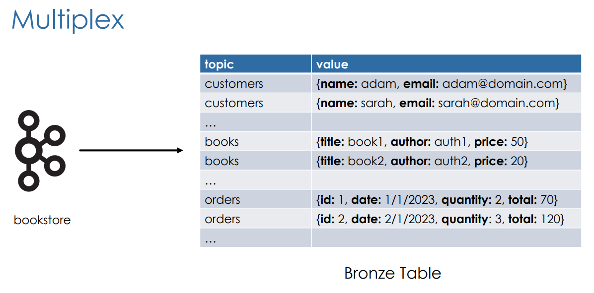

# Databricks Professional

## Ingestion Patters

- Singleplex: The traditional ingestion method where each data source/topic is ingested into one bronze table. This usually works well for batch processing, but not good for large or streaming dataset because you'll hit the max datasource/topic very quickly. 

- Multiplex: Combines many topics and streams them into a single bronze table. Pub/sub systems (Kafka) are generally used as sources but files and objects can be used as well with Auto Loader.
  - The multiplex bronze table will then be filtered by topics to create the silver tables.

## Slowly Changing Dimensions (SCDs)

SCDs are a data management concept that determines how tables handle data that changes over time. Main things to consider are whether you want to `overwrite` or `retain` data history. 

There are 3 types which are easy to implement:
  - `Type 0`: No changes allowed
    - Static/Append only

  